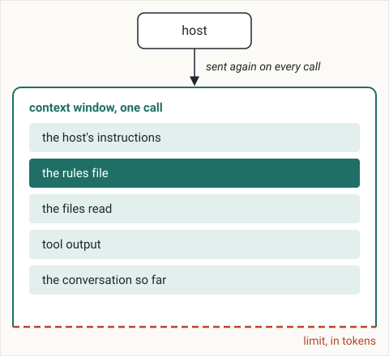

# How an agent sees your project

The model behind a coding agent remembers nothing from one call to the next.
After this chapter you can explain why a coding agent knows only what is in its context window at each call, why a long session gets worse, and what to keep in writing so that a fresh session starts right.

## The model remembers nothing between calls

A coding agent is two programs.
The model reads text and writes text.
The host, the program you run (Claude Code, Codex, Cursor and others), reads your files, runs commands, talks to the model and shows you the result.
Each time the host needs the model, it makes a call: it sends text and receives an answer.

The model keeps nothing from one call to the next.
Anthropic's documentation says so directly: "*The Messages API is stateless, which means that you always send the full conversational history to the API.*"[^messages-api]
The conversation you see on the screen is kept by the host, which sends all of it again with every call.
A fresh session starts with an empty conversation, and the model knows nothing of the previous one, however long it was.

## The context window

Everything the model sees in one call is its context window.
In a coding agent it holds:

* the host's instructions: which tools exist, how to use them, how to answer;
* the rules file, `AGENTS.md` or the host's equivalent, which the host loads when a session starts;
* the files the agent has read in this session;
* the output of the tools it ran: commands, searches, test results;
* the conversation so far: your messages and its answers.



The window is measured in tokens.
A token is the unit of text a model reads and counts: a common word is one token, a long or rare word is a few.
Each model has a limit on how many tokens one call can hold.
Every file the agent reads and every output it receives takes space in the window and stays there for the rest of the session.

## More context, less accuracy

A long session puts more in the window, and the model uses what is there less well.
This loss of accuracy as the context grows is called context rot.

Liu and colleagues gave models a question and many documents, only one of which held the answer, and moved that document through the input.
Accuracy "*is often highest when relevant information occurs at the beginning or end of the input context, and significantly degrades when models must access relevant information in the middle of long contexts, even for explicitly long-context models.*"[^liu-2024]

Chroma measured 18 models as the input grew and found that "*model performance varies significantly as input length changes, even on simple tasks*", and that "*their performance grows increasingly unreliable as input length grows.*"[^chroma-2025]

Anthropic describes the same effect in every model: "*as the number of tokens in the context window increases, the model's ability to accurately recall information from that context decreases.*"[^anthropic-context-2025]
It calls context "*a finite resource with diminishing marginal returns.*"[^anthropic-context-2025]

In a session, this means the instruction you gave at the start ends up in the middle, under every file read and every command output that came after it.

## When the window fills

A session that goes on long enough reaches the limit.
The host can then compact it, which Anthropic describes as "*taking a conversation nearing the context window limit, summarizing its contents, and reinitiating a new context window with the summary.*"[^anthropic-context-2025]

Compaction lets the session continue, and it costs detail.
A summary is shorter than what it summarizes, and it keeps what looked important when it was written.
Anthropic warns that compacting too aggressively "*can result in the loss of subtle but critical context whose importance only becomes apparent later.*"[^anthropic-context-2025]
A decision you made in the conversation, and that the agent followed until then, can be the detail the summary drops.

## What this changes in your project

Two practices follow.

**Decisions go in files the agent reads at the start of every session.**
A decision that lives only in the conversation is gone in a fresh session and can be lost in a compaction.
A decision in a file is loaded whole at the start of every session, near the beginning of the window.
The rules file is the entry point: short, and it names the documents to read before acting.
This is the start of this book's own rules file, the first thing a fresh session in its repository reads:

```markdown
# One Page at a Time

A free, bilingual book that teaches Spec-Driven Development, the focus-kit method, the optional FOCUS architecture and git for parallel agents, from beginner to advanced. Prose of the process documents in English; identifiers in English; the book in English (source) and Brazilian Portuguese.

## Read before acting
- the product: docs/00 · the vocabulary: docs/03
- how it is built: docs/01 · the server: docs/02
- style and tests: docs/04 · process: docs/05 · queue: docs/06
```

Chapter 6 builds these documents for your project.

**Each delivery gets a fresh session.**
In a fresh session the window holds the rules file, the documents and the page of the delivery, and nothing left over from the previous one.
Deciding and building go in separate sessions too.
The conversation that weighed the options, including the ones you rejected, stays out of the window where the code is written; what reaches it is the decision, written on one page.
In focus-kit, `/propose` writes that page and `/apply` builds it in a fresh session; chapters 10 and 11 teach them.

## Key points

* The model remembers nothing between calls: the host sends the whole conversation every time, and a fresh session starts empty.
* The context window is everything the model sees in one call: the host's instructions, the rules file, the files read, tool output and the conversation so far, measured in tokens, up to a limit.
* More context means less accuracy: information in the middle of a long input is used worst, and reliability falls as the input grows, even on simple tasks.
* Compaction replaces the conversation with a summary, and a detail that mattered can be lost.
* Keep decisions in files read at the start of every session, and give each delivery a fresh session, with deciding apart from building.

[^messages-api]: Anthropic, "Using the Messages API", accessed 2026-09-25. https://platform.claude.com/docs/en/build-with-claude/working-with-messages
[^liu-2024]: Liu et al., "Lost in the Middle: How Language Models Use Long Contexts", 2024. https://arxiv.org/abs/2307.03172
[^chroma-2025]: Chroma, "Context Rot: How Increasing Input Tokens Impacts LLM Performance", 2025. https://research.trychroma.com/context-rot
[^anthropic-context-2025]: Anthropic, "Effective context engineering for AI agents", 2025. https://www.anthropic.com/engineering/effective-context-engineering-for-ai-agents
