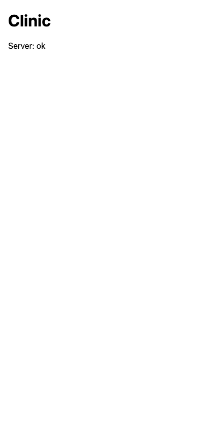

# `/apply`: build, verify, prove, never commit

After this chapter you can run `/apply` on a reviewed page in a fresh session and follow what it does, from the page to a staged change.
You can review that change against the page before committing it, and commit it yourself.

## What it does

`/apply <slug>`, whose file is `apply/SKILL.md`, builds the delivery that `work/<slug>.md` describes, completely, in one session: the code, the tests, the proof and the documents.
It starts in a fresh session ([chapter 2](02-how-agents-see.md)): the page is all it takes from the conversation that wrote it, which is why [chapter 10](10-propose.md) asks you to read the page before this command runs.

### What it reads

The page, `AGENTS.md`, and three of the project documents: docs/01, the architecture, which says where each piece goes and how errors travel; docs/04, the conventions, which say which tests to write; and docs/05, the process.
docs/05 holds the project's slots, and `/apply` follows them literally: the verify command, the environments and what a delivery leaves in each, how a screen is proven, the publish policy and the git strategy ([chapter 6](06-the-documents.md)).
On a branch or a worktree, it works on the one `/propose` created for the slug.

### The page is the scope

What the page asks is what gets built, and nothing around it.
`apply/SKILL.md` says it in one line: "*The page is the scope; do not widen it.*"
So `/apply` adds no dependency, layer or tool the page did not name, abstracts only on the second concrete occurrence (and the page says which was the first), and writes no em dash in any text a user reads.

### When the page contradicts a document

It stops and says which.
Either the document changes in the same delivery, or the page is wrong; it never picks one silently.
A silent choice would leave a page and a document that disagree, and the next session would build on whichever it read first.

### Verify and the proof

It runs the verify command until it is green.
Then it proves the delivery the way docs/05 says: a screenshot against the reference, a run from end to end, or a check by hand.
It lists what diverges from the reference and fixes it, until only what it can justify remains; a failure is part of the proof and is recorded, not hidden.

### What "done" means

Green is not done.
Before it stops, `/apply` does all of this:

* It writes into the page what happened: what diverged from the plan and why, what was dropped, what the proof found, and the decisions taken, with an ADR if one was needed.
* It updates the documents the delivery changed: a new term into docs/03, a new rule into the document that owns it, a decision into docs/adr/.
* It ticks every item of Done when.
* It moves the page to `work/done/`, and turns the line's mark in docs/06 from `[>]` to `[x]` ([chapter 9](09-queue-and-milestones.md)).
* It runs `git add -A` and suggests the commit message in the format docs/05 defines.
* The last thing it says is which environment is at which version, and the command that updates the others.

### Why it stops at the stage

`/apply` never commits and never merges, whatever the git strategy.
It stages everything and hands you the message; the commit is yours, and it comes after your review, in the last section of this chapter.

## The run on the clinic

The run started where chapter 10 left the clinic: commit [`3f0b47c`](https://github.com/JCKodel/focus-kit-clinic/commit/3f0b47c1868e69970eefadb4f4a34bdcbada67b2), with the reviewed page `work/skeleton.md` and the line `skeleton` at `[>]` in docs/06, both uncommitted.
The page asks for the empty app and server in one project: a first screen that asks the server `GET /api/health` and shows "Server: ok", a migration runner for SQLite, `npm run verify`, and one screenshot at phone size as proof.

Open your host at the root of the project, in a fresh session, and type:

```
/apply skeleton
```

There is no brief this time: the page is the brief.
I ran it headless in Claude Code, with a list of the shell commands it could run on its own: npm, npx and node, `mkdir` and `cp`, and `git add`, `git status` and `git diff`.[^apply-run]
`git commit`, `git push` and `git tag` were not on the list, so a commit would have been refused as well as being against the kit.
I also denied `npm run dev` on purpose: a headless session that starts a server can leave it holding the port, and the clinic's docs/05 wants that server running on my machine, not inside the agent's turn.

The agent read the page and the documents, installed the packages and a browser for Playwright, and wrote the code, the config and the tests.[^apply-run]
It ran `npm run verify`, green the first time, then started the server by hand with a migration file made to fail, saw it stop with exit code 1 and the file's name, and deleted the file.
It tried `npm run dev`, which was denied, and took the screenshot with a line added to a Playwright test instead.
It updated docs/01, 02, 04, 05 and 06, wrote what happened into the page and moved it to `work/done/`.
Removing the screenshot line left a formatting error, so verify went red on Biome's check; the agent fixed it and ran verify again.
This is the end of that last run, from the Vitest tests to the build:[^apply-run]

```
> test
> vitest run


 RUN  v5.0.2 .


 Test Files  2 passed (2)
      Tests  7 passed (7)
   Start at  15:21:47
   Duration  104ms (transform 56%, tests 19%, import 18%, worker 7%)


> test:e2e
> playwright test


Running 4 tests using 1 worker

  ✓  1 [phone] › src/features/health/HealthView.e2e.ts:3:1 › shows the server as ok when it answers (113ms)
  ✓  2 [phone] › src/features/health/HealthView.e2e.ts:10:1 › shows the check while the answer is on its way (101ms)
  ✓  3 [phone] › src/features/health/HealthView.e2e.ts:20:1 › shows the server as unreachable when it answers with an error (96ms)
  ✓  4 [phone] › src/features/health/HealthView.e2e.ts:30:1 › shows the server as unreachable when it does not answer (97ms)

  4 passed (1.5s)

> build
> vite build

vite v8.3.1 building client environment for production...
transforming...
✓ 21 modules transformed.
rendering chunks...
computing gzip size...
dist/index.html                  0.39 kB │ gzip:  0.28 kB
dist/assets/index-DD_Vn2PP.js  220.36 kB │ gzip: 68.89 kB

✓ built in 52ms
```

Seven unit tests of the migration runner and the database, four Playwright tests of the page's states at 390×844, and a build.[^apply-run]
This is the screenshot it saved as proof, `work/done/skeleton-390x844.png`, as it ran:[^apply-run]



It is what the page's Visual reference describes, the `system-ui` font, 16 pixels on each side and the browser's default colours, and nothing more.[^apply-run]
Then the agent wrote what happened on the page; this is that section as the run left it:[^apply-run]

```markdown
## What happened

**Built.** `src/lib/result.ts`; the `health` slice (`route.server.ts`,
`api.ts`, `useHealth.ts`, `HealthView.tsx`, `strings.ts`,
`HealthView.e2e.ts`); the server shell (`main.server.ts`,
`database.server.ts`, `migrate.server.ts`, empty `migrations/`); the app
shell (`src/app/main.tsx`, `src/app/strings.ts`, `index.html`); config for
TypeScript, Biome, Vite and Playwright; `.gitignore`.

**Diverged from the plan, and why.**

* `@hono/node-server` was added next to `hono`: Hono needs an adapter to
  listen on a Node port. It is part of "Node with Hono", recorded in docs/01.
* The server has no build and no runner such as `tsx`: Node `>=24` runs
  `.ts` directly by type stripping. Consequence, in docs/01: imports carry
  `.ts`, and `erasableSyntaxOnly` forbids enums and similar syntax.
* `npm run dev` is `node --watch src/server/main.server.ts & vite`, the
  shell's `&` instead of a tool like `concurrently`, since the page named no
  such tool. Ctrl+C stops both, as they share the terminal's process group.
* `openDatabase` returns `Result<DatabaseSync, DatabaseOpenFailed>` rather
  than throwing, so `throw` is not flow in the server start either. It is
  the third use of `Result` (first: health `api.ts`; second: `migrate`).
* `migrate` also returns `MigrationFailed` when the folder cannot be read or
  `schema_migration` cannot be created. No file was reached then, so `file`
  holds the folder path. The contract names only the per-file case.
* The unreachable state has two Playwright tests (500 answer, aborted
  request), one for each case of Behaviour; the page counted three states.
* The client's error code is `ServerUnreachable`. It is an infrastructure
  code, like `MigrationFailed` and `DatabaseOpenFailed`, so it is not a term
  of docs/03.
* npm installed the current majors: TypeScript 7, Vite 8, Vitest 5,
  Playwright 1.63, Biome 2, React 19, Hono 4.

**Dropped.** Nothing from Behaviour or Contract.

**What the proof found.** The screenshot at 390×844 shows "Clinic" and
"Server: ok" in `system-ui`, left-aligned with 16px on each side, browser
default colours: nothing diverges from the Visual reference. It was taken
by a one-off `page.screenshot` in the "ok" Playwright test, removed after
the run. A manual start with a temporary failing `0001-broken.sql` in
`src/server/migrations/` exited with code 1 and
`Migration 0001-broken.sql failed: no such table: missing`, left only
`schema_migration` (empty) in the database, and the file was removed.

**Decisions.** Playwright files are `*.e2e.ts` next to their view, and
Playwright starts its own server and Vite on ports 3100 and 5174 with a
database in the system temp folder (docs/04). No ADR: every choice sits
inside ADR-0001.
```

Read it as the agent's account of every choice the page did not make: an adapter package, how the server runs its TypeScript, how two processes start together, and the versions npm installed on the day.
It staged everything with `git add -A`; this is `git status --short` of the clinic after it:[^apply-run]

```
A  .gitignore
A  biome.json
M  docs/01-Architecture.md
M  docs/02-Backend.md
M  docs/04-Conventions.md
M  docs/05-Process.md
M  docs/06-Queue.md
A  index.html
A  package-lock.json
A  package.json
A  playwright.config.ts
A  src/app/main.tsx
A  src/app/strings.ts
A  src/features/health/HealthView.e2e.ts
A  src/features/health/HealthView.tsx
A  src/features/health/api.ts
A  src/features/health/route.server.ts
A  src/features/health/strings.ts
A  src/features/health/useHealth.ts
A  src/lib/result.ts
A  src/server/database.server.test.ts
A  src/server/database.server.ts
A  src/server/main.server.ts
A  src/server/migrate.server.test.ts
A  src/server/migrate.server.ts
A  src/server/migrations/.gitkeep
A  tsconfig.json
A  vite.config.ts
A  work/done/skeleton-390x844.png
A  work/done/skeleton.md
```

The code, the page in `work/done/` with its screenshot, and the documents the delivery changed, all in one staged tree.
It suggested this commit message, in the format of the clinic's [docs/05 §6](https://github.com/JCKodel/focus-kit-clinic/blob/book-v1/apply/docs/05-Process.md):[^apply-run]

```
Build the skeleton: health page, Hono server, migrations, verify

- Health slice: GET /api/health and a page showing checking, ok, unreachable
- Server start opens data/clinic.sqlite and applies SQL migrations in order
- Result moves to src/lib on its second use (migrate)
- npm run dev runs client and server; npm run verify runs all checks
- Vitest tests for migrate and database opening; Playwright at 390x844

See work/done/skeleton.md
```

And its last words were the environments, as the kit asks:[^apply-run]

```markdown
**Environments:**
- **local:** the code is at this delivery and `data/clinic.sqlite` exists with no migrations to apply, but nothing is running. Start it with `npm run dev`: the client is at http://localhost:5173 and the server on port 3000.
- **production:** doesn't exist yet. The `deploy` delivery will create it.
```

The item "`npm run dev` leaves client and server running locally" was mine, not the run's: after the run I started `npm run dev`, opened the page and `/api/health`, saw both answer, and kept it running through the review.[^apply-run]
The code itself is at the tag [`book-v1/apply`](https://github.com/JCKodel/focus-kit-clinic/tree/book-v1/apply); Part III teaches how it is organized.

## Review before you commit

The staged change is what the agent says it did; your review checks that it did it.
Ask it these questions:

* Is every Done when item ticked, and is each one true?
* Does What happened say what diverged, and would you have decided any of it otherwise?
* Did the documents the delivery changed get updated, and only those?
* Is anything built that the page did not ask for?
* Do verify and the proof run for you?

Ask the agent for each correction, in the same session, never by hand ([chapter 6](06-the-documents.md)).
The same session keeps the reasoning of the build: it knows why it made each choice, which a fresh session would have to guess.

As in chapter 10, a second agent read the staged change against the page and the kit, the one running this book's `/apply`, and listed what it found; I checked each item and took all of them.
I sent the list to the run's session with `--continue`, the headless way of typing in the same session ([chapter 7](07-brainstorm.md)); interactively, you send it in the session where `/apply` ran.
I sent it as it was:[^apply-run]

```markdown
1. **A package the page didn't name.** The kit says to add no dependency the page did not name. The agent added `@hono/node-server` without stopping to ask; it only recorded it in docs/01.
2. **A proof missing from the page.** The claim that a second start applies nothing was proven only by a Vitest test. The agent said so in its reply, but the page's What happened doesn't.
3. **An explanation in the wrong place.** The agent wrote why `npm run dev` wasn't run inside the unticked Done when item itself, instead of in What happened.
4. **A rule nobody running headless can follow.** The clinic's docs/05 still says "a delivery leaves it running", which a headless agent can't do. You might want the document to say that you start it yourself.
5. **An untested claim.** The page says "Ctrl+C stops both". You can check this when you start `npm run dev`: port 3000 should be free afterwards.
```

The first item is the kit's own rule: a dependency the page did not name is a question for the person, not a choice for the agent.
The fourth is a rule of the clinic's docs/05 that a headless agent cannot keep, so the document changed, not the agent's behaviour.
The agent fixed the page and docs/05, said it should have asked before adding `@hono/node-server`, and asked me whether to keep it.
I answered "Keep it", in the same session, and it recorded my approval on the page.[^apply-run]
It also saved two notes in Claude Code's own memory for the clinic, outside the repository; I deleted them, so that the book's next runs start as yours will.
This is the diff the review made to the staged files:[^apply-run]

```diff
--- a/docs/05-Process.md
+++ b/docs/05-Process.md
@@ -58,8 +58,10 @@
   failure. Green before anything is declared done.
 * **Environments:**
   * local: client and server on the developer's machine with a local SQLite
-    file; a delivery leaves it running with its migrations applied. Command:
-    `npm run dev` (client and server together; migrations apply at start).
+    file. Command: `npm run dev` (client and server together; migrations
+    apply at start). A delivery leaves the code ready to start and names the
+    command; the person starts it, since the agent may run headless and
+    cannot keep a process running.
   * production: a machine at the clinic or a free host; created by the
     `deploy` delivery, which writes its line here.
 * **Proof of a screen:** Playwright screenshots. Client screens at phone
--- a/work/done/skeleton.md
+++ b/work/done/skeleton.md
@@ -120,9 +120,7 @@
       to `work/done/skeleton-390x844.png`; it is not part of `npm run verify`.
 * [x] `npm run verify` is green.
 * [ ] `npm run dev` leaves client and server running locally, with the
-      SQLite file created. The SQLite file exists (`data/clinic.sqlite`,
-      created by a server start); the agent's session was not allowed to
-      start a long-running process, so the person starts `npm run dev`.
+      SQLite file created.
 * [x] docs/02 lists `GET /api/health` and `schema_migration`; docs/01 and
       docs/05 name the local command.
 
@@ -137,14 +135,17 @@
 
 **Diverged from the plan, and why.**
 
-* `@hono/node-server` was added next to `hono`: Hono needs an adapter to
-  listen on a Node port. It is part of "Node with Hono", recorded in docs/01.
+* `@hono/node-server` was added next to `hono` although the page did not
+  name it: Hono needs an adapter to listen on a Node port. The agent should
+  have stopped and asked; it did not. The person approved it at review, so
+  it stays, recorded in docs/01.
 * The server has no build and no runner such as `tsx`: Node `>=24` runs
   `.ts` directly by type stripping. Consequence, in docs/01: imports carry
   `.ts`, and `erasableSyntaxOnly` forbids enums and similar syntax.
 * `npm run dev` is `node --watch src/server/main.server.ts & vite`, the
   shell's `&` instead of a tool like `concurrently`, since the page named no
-  such tool. Ctrl+C stops both, as they share the terminal's process group.
+  such tool. Ctrl+C should stop both, as they share the terminal's process
+  group; this is untested (see What the proof found).
 * `openDatabase` returns `Result<DatabaseSync, DatabaseOpenFailed>` rather
   than throwing, so `throw` is not flow in the server start either. It is
   the third use of `Result` (first: health `api.ts`; second: `migrate`).
@@ -170,6 +171,19 @@
 `Migration 0001-broken.sql failed: no such table: missing`, left only
 `schema_migration` (empty) in the database, and the file was removed.
 
+Not proven outside a test:
+
+* "Starting the server a second time applies no migration" is proven only
+  by the Vitest test that runs `migrate` twice on one database. The server
+  was never started twice, since the only real start was the failing one
+  above.
+* `npm run dev` was not run. The agent's session was headless and not
+  allowed to start a long-running process, so the Done when item stays
+  unticked. `data/clinic.sqlite` exists, created by the failing start
+  above, with no migration recorded. The person starts `npm run dev`.
+* "Ctrl+C stops both" is untested. Check: after stopping `npm run dev`,
+  port 3000 is free (`lsof -i :3000` prints nothing).
+
 **Decisions.** Playwright files are `*.e2e.ts` next to their view, and
 Playwright starts its own server and Vite on ports 3100 and 5174 with a
 database in the system temp folder (docs/04). No ADR: every choice sits
```

Nothing in the code changed: the review corrected the record, which is what the next person reads.
One thing it left uncorrected: the Done when item "`npm run dev` leaves client and server running locally" is still unticked in the page I committed, although I had checked it by hand after the run.
That was my lapse: I should have asked the agent, in the same session, to tick it and to write on the page how it was checked; I did not, and the published tag does not move.
On yours, ask for that tick and that line before you commit, so the answer to "Is every Done when item ticked, and is each one true?" is yes.
Then I committed the staged tree with the suggested message:

```
git commit
```

With no `-m`, git opens an editor for the message; mine opened nano, I pasted the suggested message as the agent gave it, subject, blank line and bullets, saved and closed, and the commit exists when the editor closes.
Git opens the editor named in `core.editor`, usually vi when none is set; `git config --global core.editor nano`, or `git config --global core.editor "code --wait"` for VS Code, chooses another.
Chapter 17 teaches the rest of git.
After that I tagged the commit `book-v1/apply` and pushed both.
The page and its build are in that one commit: the unit of work of chapter 10, which reverts in one step.

The agent never commits because the commit is your review.
A commit says a person read the change and accepts it; an agent that commits its own work skips the only reader who can say the build is what was wanted.
Part IV comes back to this with the git side: branches, merges, and the commit as review.

## Key points

* `/apply <slug>` builds the page in a fresh session, and the page is the scope: no dependency, layer or tool the page did not name.
* It follows docs/05 literally, and when the page contradicts a document it stops and says which; it never resolves it silently.
* Done is more than green: the proof with its divergences, What happened, the documents, Done when, `work/done/`, `[x]`, the staged tree, the suggested message, and the environments said last.
* The agent stages, you review and commit: check Done when, What happened, the documents and anything the page did not ask for, and ask for each correction in the same session.
* On trunk the commit carries the page and its build together: the delivery reverts in one step.

## Exercises

These exercises use the clinic, by conversation with the agent, never by hand.

### Exercise 11.1

After exercises 10.1 and 10.2, run `/apply skeleton` in a fresh session and compare your staged change with [`book-v1/apply`](https://github.com/JCKodel/focus-kit-clinic/tree/book-v1/apply).

### Exercise 11.2

Review your staged change with the questions of "Review before you commit", ask the agent for each correction, and commit it yourself.

### Exercise 11.3

For each divergence in your page's What happened, say whether it should have been a question on the page before `/apply`.

[^apply-run]: This book's `/apply` run on the guided project, 2026-09-28, with Claude Code 2.1.284 and the model `claude-opus-5-5`, from commit 3f0b47c: the command and its permissions, every turn's output, the verify output, the screenshot, the page as the run left it, the review and its diff, and the staged status. <https://github.com/JCKodel/focus-kit-book/blob/main/work/done/apply-run/README.md>
