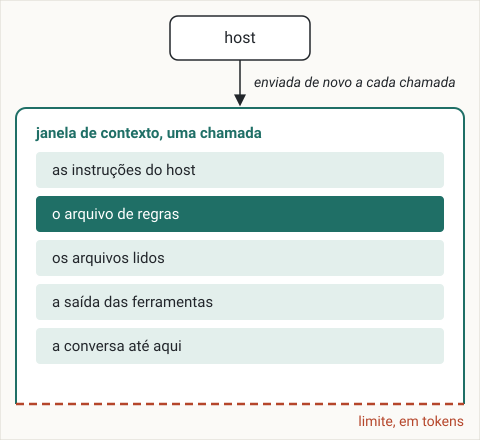

# Como um agente enxerga o seu projeto

O modelo por trás de um agente de código não se lembra de nada de uma chamada para a outra.
Depois deste capítulo você consegue explicar por que um agente de código só sabe o que está na janela de contexto a cada chamada, por que uma sessão longa piora, e o que manter por escrito para que uma sessão nova comece certa.

## O modelo não se lembra de nada entre chamadas

Um agente de código são dois programas.
O modelo lê texto e escreve texto.
O host, o programa que você roda (Claude Code, Codex, Cursor e outros), lê seus arquivos, roda comandos, conversa com o modelo e mostra o resultado.
Cada vez que o host precisa do modelo, ele faz uma chamada: envia texto e recebe uma resposta.

O modelo não guarda nada de uma chamada para a outra.
A documentação da Anthropic diz isso diretamente: "The Messages API is stateless, which means that you always send the full conversational history to the API" (a API Messages não guarda estado, então você sempre envia o histórico completo da conversa).[^messages-api]
A conversa que você vê na tela é guardada pelo host, que a envia inteira de novo a cada chamada.
Uma sessão nova começa com a conversa vazia, e o modelo não sabe nada da anterior, por mais longa que ela tenha sido.

## A janela de contexto

Tudo o que o modelo vê em uma chamada é a sua janela de contexto.
Em um agente de código, ela contém:

* as instruções do host: quais ferramentas existem, como usá-las, como responder;
* o arquivo de regras, `AGENTS.md` ou o equivalente do host, que o host carrega quando uma sessão começa;
* os arquivos que o agente leu nesta sessão;
* a saída das ferramentas que ele rodou: comandos, buscas, resultados de testes;
* a conversa até aqui: suas mensagens e as respostas dele.



A janela é medida em tokens.
Um token é a unidade de texto que um modelo lê e conta: uma palavra comum é um token, uma palavra longa ou rara são alguns.
Cada modelo tem um limite de quantos tokens uma chamada pode conter.
Cada arquivo que o agente lê e cada saída que ele recebe ocupa espaço na janela e fica lá pelo resto da sessão.

## Mais contexto, menos precisão

Uma sessão longa põe mais coisa na janela, e o modelo usa pior o que está lá.
Essa perda de precisão à medida que o contexto cresce se chama degradação de contexto.

Liu e colegas deram aos modelos uma pergunta e muitos documentos, só um dos quais tinha a resposta, e moveram esse documento ao longo da entrada.
O desempenho "is often highest when relevant information occurs at the beginning or end of the input context, and significantly degrades when models must access relevant information in the middle of long contexts, even for explicitly long-context models" (costuma ser maior quando a informação relevante está no começo ou no fim da entrada, e cai bastante quando o modelo precisa usar informação que está no meio de um contexto longo, mesmo em modelos feitos para contextos longos).[^liu-2024]

A Chroma mediu 18 modelos à medida que a entrada crescia e concluiu que "model performance varies significantly as input length changes, even on simple tasks" (o desempenho varia muito conforme o tamanho da entrada muda, mesmo em tarefas simples) e que "their performance grows increasingly unreliable as input length grows" (o desempenho fica cada vez menos confiável à medida que a entrada cresce).[^chroma-2025]

A Anthropic descreve o mesmo efeito em todos os modelos: "as the number of tokens in the context window increases, the model's ability to accurately recall information from that context decreases" (à medida que o número de tokens na janela de contexto aumenta, a capacidade do modelo de recuperar com precisão a informação desse contexto diminui).[^anthropic-context-2025]
Ela trata o contexto como "a finite resource with diminishing marginal returns" (um recurso finito, com retornos marginais decrescentes).[^anthropic-context-2025]

Em uma sessão, isso quer dizer que a instrução que você deu no começo acaba no meio, debaixo de cada arquivo lido e de cada saída de comando que veio depois dela.

## Quando a janela enche

Uma sessão que dura o bastante chega ao limite.
O host pode então compactá-la, o que a Anthropic descreve como "taking a conversation nearing the context window limit, summarizing its contents, and reinitiating a new context window with the summary" (pegar uma conversa perto do limite da janela de contexto, resumir o seu conteúdo e recomeçar uma nova janela de contexto com o resumo).[^anthropic-context-2025]

A compactação deixa a sessão continuar, e custa detalhe.
Um resumo é mais curto do que o que ele resume, e guarda o que parecia importante quando foi escrito.
A Anthropic avisa que compactar de forma agressiva demais "can result in the loss of subtle but critical context whose importance only becomes apparent later" (pode fazer perder um contexto sutil, mas crítico, cuja importância só aparece mais tarde).[^anthropic-context-2025]
Uma decisão que você tomou na conversa, e que o agente seguiu até ali, pode ser o detalhe que o resumo deixa de fora.

## O que isso muda no seu projeto

Daí saem duas práticas.

**Decisões ficam em arquivos que o agente lê no começo de toda sessão.**
Uma decisão que só existe na conversa some em uma sessão nova e pode se perder em uma compactação.
Uma decisão em um arquivo é carregada inteira no começo de toda sessão, perto do início da janela.
O arquivo de regras é a porta de entrada: curto, e diz quais documentos ler antes de agir.
Este é o começo do arquivo de regras deste livro, a primeira coisa que uma sessão nova no repositório dele lê:

```markdown
# One Page at a Time

A free, bilingual book that teaches Spec-Driven Development, the focus-kit method, the optional FOCUS architecture and git for parallel agents, from beginner to advanced. Prose of the process documents in English; identifiers in English; the book in English (source) and Brazilian Portuguese.

## Read before acting
- the product: docs/00 · the vocabulary: docs/03
- how it is built: docs/01 · the server: docs/02
- style and tests: docs/04 · process: docs/05 · queue: docs/06
```

O capítulo 6 constrói esses documentos para o seu projeto.

**Cada entrega ganha uma sessão nova.**
Em uma sessão nova, a janela contém o arquivo de regras, os documentos e a página da entrega, e nada que tenha sobrado da anterior.
Decidir e construir também ficam em sessões separadas.
A conversa que pesou as opções, inclusive as que você descartou, fica fora da janela onde o código é escrito; o que chega a ela é a decisão, escrita em uma página.
No focus-kit, o `/propose` escreve essa página e o `/apply` a constrói em uma sessão nova; os capítulos 10 e 11 ensinam os dois.

## Pontos-chave

* O modelo não se lembra de nada entre chamadas: o host envia a conversa inteira toda vez, e uma sessão nova começa vazia.
* A janela de contexto é tudo o que o modelo vê em uma chamada: as instruções do host, o arquivo de regras, os arquivos lidos, a saída das ferramentas e a conversa até aqui, medida em tokens, até um limite.
* Mais contexto quer dizer menos precisão: a informação no meio de uma entrada longa é a mais mal usada, e a confiabilidade cai à medida que a entrada cresce, mesmo em tarefas simples.
* A compactação troca a conversa por um resumo, e um detalhe que importava pode se perder.
* Mantenha as decisões em arquivos lidos no começo de toda sessão, e dê a cada entrega uma sessão nova, com decidir separado de construir.

[^messages-api]: Anthropic, "Using the Messages API", acesso em 2026-09-25. https://platform.claude.com/docs/en/build-with-claude/working-with-messages
[^liu-2024]: Liu et al., "Lost in the Middle: How Language Models Use Long Contexts", 2024. https://arxiv.org/abs/2307.03172
[^chroma-2025]: Chroma, "Context Rot: How Increasing Input Tokens Impacts LLM Performance", 2025. https://research.trychroma.com/context-rot
[^anthropic-context-2025]: Anthropic, "Effective context engineering for AI agents", 2025. https://www.anthropic.com/engineering/effective-context-engineering-for-ai-agents
