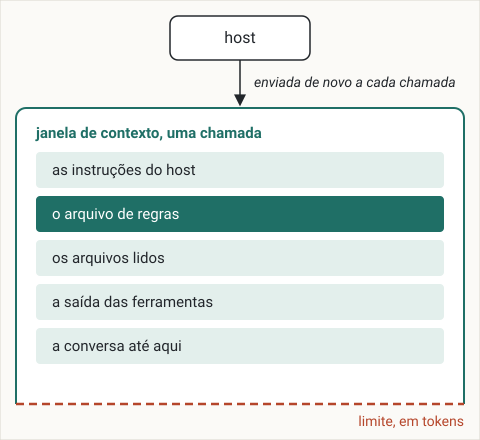

# Como um agente vê o seu projeto

O modelo por trás de um agente de código não se lembra de nada de uma chamada para a outra.
Depois deste capítulo você consegue explicar por que um agente de código só sabe o que está na sua janela de contexto a cada chamada, por que uma sessão longa piora, e o que manter por escrito para que uma sessão nova comece certa.

## O modelo não se lembra de nada entre chamadas

Um agente de código são dois programas.
O modelo lê texto e escreve texto.
O host, o programa que você executa (Claude Code, Codex, Cursor e outros), lê seus arquivos, executa comandos, conversa com o modelo e mostra o resultado a você.
Cada vez que o host precisa do modelo, ele faz uma chamada: envia texto e recebe uma resposta.

O modelo não guarda nada de uma chamada para a outra.
A documentação da Anthropic diz isso diretamente: "*A Messages API não tem estado, o que significa que você sempre envia o histórico completo da conversa para a API.*"[^messages-api]
A conversa que você vê na tela é guardada pelo host, que a envia inteira de novo a cada chamada.
Uma sessão nova começa com uma conversa vazia, e o modelo não sabe nada da anterior, por mais longa que ela tenha sido.

## A janela de contexto

Tudo o que o modelo vê numa chamada é a sua janela de contexto.
Num agente de código, ela contém:

* as instruções do host: quais ferramentas existem, como usá-las, como responder;
* o arquivo de regras, `AGENTS.md` ou o equivalente do host, que o host carrega quando uma sessão começa;
* os arquivos que o agente leu nesta sessão;
* a saída das ferramentas que ele executou: comandos, buscas, resultados de testes;
* a conversa até aqui: suas mensagens e as respostas dele.



A janela é medida em tokens.
Um token é a unidade de texto que um modelo lê e conta: uma palavra comum é um token, uma palavra longa ou rara é alguns.
Cada modelo tem um limite de quantos tokens uma chamada pode conter.
Cada arquivo que o agente lê e cada saída que ele recebe ocupam espaço na janela e ficam lá pelo resto da sessão.

## Mais contexto, menos precisão

Uma sessão longa põe mais coisa na janela, e o modelo usa pior o que está lá.
Essa perda de precisão conforme o contexto cresce se chama degradação de contexto.

Nelson Liu e colegas, no artigo "Lost in the Middle" (perdido no meio), publicado em 2024 na Transactions of the Association for Computational Linguistics, deram aos modelos uma pergunta e muitos documentos, só um dos quais tinha a resposta, e moveram esse documento ao longo da entrada.
A precisão "*costuma ser maior quando a informação relevante aparece no início ou no fim do contexto de entrada, e cai de forma significativa quando os modelos precisam acessar informação relevante no meio de contextos longos, mesmo em modelos feitos explicitamente para contextos longos.*"[^liu-2024]

A Chroma, a empresa por trás de um banco de dados de busca de código aberto para aplicações de IA, mediu 18 modelos conforme a entrada crescia, num relatório de 2025, e descobriu que "*o desempenho do modelo varia de forma significativa conforme o tamanho da entrada muda, mesmo em tarefas simples*", e que "*seu desempenho fica cada vez menos confiável conforme a entrada cresce.*"[^chroma-2025]

A Anthropic descreve o mesmo efeito em todos os modelos: "*conforme o número de tokens na janela de contexto aumenta, a capacidade do modelo de recuperar com precisão informações desse contexto diminui.*"[^anthropic-context-2025]
Ela chama o contexto de "*um recurso finito com retornos marginais decrescentes.*"[^anthropic-context-2025]

Numa sessão, isso quer dizer que a instrução que você deu no início acaba no meio, debaixo de cada arquivo lido e de cada saída de comando que veio depois dela.

## Quando a janela enche

Uma sessão que dura o bastante chega ao limite.
O host pode então compactá-la, o que a Anthropic descreve como "*pegar uma conversa que se aproxima do limite da janela de contexto, resumir seu conteúdo e reiniciar uma nova janela de contexto com o resumo.*"[^anthropic-context-2025]

A compactação deixa a sessão continuar, e custa detalhes.
Um resumo é mais curto do que o que ele resume, e guarda o que parecia importante quando foi escrito.
A Anthropic avisa que compactar de forma agressiva demais "*pode resultar na perda de contexto sutil, mas crítico, cuja importância só fica evidente mais tarde.*"[^anthropic-context-2025]
Uma decisão que você tomou na conversa, e que o agente seguia até então, pode ser o detalhe que o resumo descarta.

## O que isso muda no seu projeto

Duas práticas decorrem disso.

**As decisões vão para arquivos que o agente lê no início de toda sessão.**
Uma decisão que vive só na conversa some numa sessão nova e pode se perder numa compactação.
Uma decisão num arquivo é carregada inteira no início de toda sessão, perto do começo da janela.
O arquivo de regras é a porta de entrada: curto, e ele nomeia os documentos a ler antes de agir.
Este é o começo de um arquivo de regras de uma pequena biblioteca de empréstimos, o projeto cujo código a Parte I usa como exemplo a partir do capítulo 4, escrito para este capítulo:

```markdown
# Biblioteca de empréstimos

Uma pequena biblioteca empresta exemplares dos seus livros a membros; um bibliotecário registra cada empréstimo e cada devolução.

## Leia antes de agir
- o produto: docs/00 · o vocabulário: docs/03
- como é construído: docs/01 · estilo e testes: docs/04
- processo: docs/05 · fila: docs/06
```

Uma sessão nova lê o que o projeto é numa linha, depois onde mora cada tipo de fato; os arquivos que ele nomeia guardam o resto, e o [capítulo 10](10-the-documents.md) os explica.

**Cada entrega ganha uma sessão nova.**
Numa sessão nova, a janela contém o arquivo de regras, os documentos e a página da entrega, e nada que tenha sobrado da anterior.
Decidir e construir também ficam em sessões separadas.
A conversa que pesou as opções, incluindo as que você rejeitou, fica fora da janela onde o código é escrito; o que chega a ela é a decisão, escrita numa página.
No focus-kit, o `/propose` escreve essa página ([capítulo 14](14-propose.md)) e o `/apply` a constrói numa sessão nova ([capítulo 15](15-apply.md)).

## O que o time ganha

As decisões sobrevivem à sessão.
O que o time decidiu está em arquivos que toda sessão carrega inteiros, perto do início da janela, então não pode cair no meio de uma conversa longa nem ficar de fora de um resumo.
Uma pessoa que entra no projeto lê os mesmos arquivos que o agente lê, e recebe a mesma resposta.

O mesmo vale para o trabalho em si.
No focus-kit, toda entrega tem uma página que registra por que ela foi feita, o que "pronto" queria dizer e, depois de construída, o que foi feito e como; a página é commitada junto com o código que ela descreve ([capítulo 14](14-propose.md)).
Tudo o que o projeto fez, e como, está escrito e versionado ao lado do código, então alguém novo no projeto, desenvolvedor ou gestor, faz uma pergunta sobre ele ao agente e recebe uma resposta lida dessas páginas, e não da memória de um colega.
Não há medida desse ganho neste livro; a evidência é a perda que ele evita, que os estudos acima mediram.

## Pontos-chave

* O modelo não se lembra de nada entre chamadas: o host envia a conversa inteira toda vez, e uma sessão nova começa vazia.
* A janela de contexto é tudo o que o modelo vê numa chamada: as instruções do host, o arquivo de regras, os arquivos lidos, a saída das ferramentas e a conversa até aqui, medida em tokens, até um limite.
* Mais contexto significa menos precisão: a informação no meio de uma entrada longa é a mais mal usada, a confiabilidade cai conforme a entrada cresce, e a compactação substitui a conversa por um resumo que pode descartar um detalhe que importava.
* Guarde as decisões em arquivos lidos no início de toda sessão, e dê a cada entrega uma sessão nova, com o decidir separado do construir.
* A página de toda entrega, o porquê, o que "pronto" queria dizer e o que foi feito, é versionada com o código dela, então quem chega pergunta ao agente sobre o projeto e recebe uma resposta lida das páginas.

[^messages-api]: Anthropic, "Using the Messages API", acesso em 2026-09-25. <https://platform.claude.com/docs/en/build-with-claude/working-with-messages>
[^liu-2024]: Liu et al., "Lost in the Middle: How Language Models Use Long Contexts", 2024. <https://arxiv.org/abs/2307.03172>
[^chroma-2025]: Chroma, "Context Rot: How Increasing Input Tokens Impacts LLM Performance", 2025. <https://research.trychroma.com/context-rot>
[^anthropic-context-2025]: Anthropic, "Effective context engineering for AI agents", 2025. <https://www.anthropic.com/engineering/effective-context-engineering-for-ai-agents>
